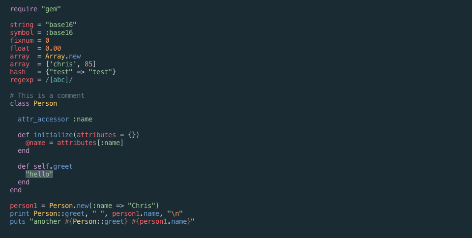

This project generates the [Oceanic Next](https://github.com/voronianski/oceanic-next-color-scheme) color scheme
for a variety of text editors using [base16-builder](https://github.com/chriskempson/base16-builder).

Take a look!

Building:

To build, you'll need node, npm, and GNU Make.

Just run `make` to generate the build output. For convenience, the build output is checked in. To clear
it out, run `make clean`. That's it!

## LICENSE
MIT

Original oceanic-next theme is from Dmitri Voronianski and is also licensed MIT.
